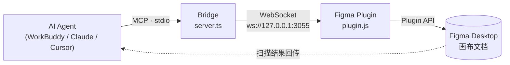
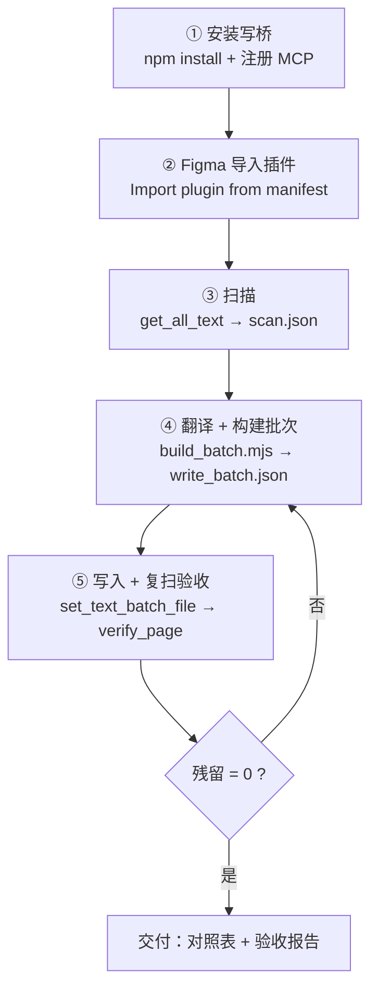

# Figma Page Auto-Translation — 保持排版的多语言翻译 Skill

> 把 Figma 里整页文案**自动翻译成任意语言并原位写回**，字体 / 字号 / 字重 / 对齐（含 RTL 左右翻转）/ 颜色 / 位置 / 自动尺寸全部保留，写完自动复扫验收「源语言残留 = 0」。

[English README](./README_EN.md) · [图文安装使用说明 (Word)](./docs/figma-translate-guide.docx) · [中英双语版 (Bilingual Word)](./docs/figma-translate-guide-bilingual.docx)

---

## 它解决什么问题

Figma 的 **REST API 是只读的**——想改画布上的文字，只能走 **Figma Plugin API**（插件运行在 Figma Desktop 内部）。
所以「让 AI 帮你翻译整页」这件事，真正的难点不是翻译，而是**怎么把译文写回画布**。

本 Skill 提供一条打通的链路：



---

## 实测战绩

一次真实任务（法语 → 阿拉伯语，RTL）：

| 指标 | 结果 |
| --- | --- |
| 页面文本节点 | 798 |
| 翻译节点 | 719（含 4 个误入的俄语公司信息节点） |
| 保留原文节点 | 79（型号 / 邮箱 / 网址 / 电话 / 纯数字 / 单位） |
| **源语言残留** | **0**（法语 / 俄语 / 中文全部清除） |
| 字体 | 719 个译文节点 → `Noto Sans Arabic`；79 个保留节点 → 原字体 `MiSans VF` |
| RTL 对齐 | 右对齐 342 / 居中 401 / 左对齐 55 |
| 豆腐块（缺字形） | 0 |

---

## 目录结构

```
figma-page-translate/
├── SKILL.md                      # Skill 正文（给 AI Agent 读的执行手册）
├── README.md                     # 你正在看的文件
├── README_EN.md                  # English version
├── LICENSE                       # MIT
├── docs/
│   ├── figma-translate-guide.docx             # 图文安装 & 使用说明（中文，Word）
│   └── figma-translate-guide-bilingual.docx   # 中英双语版（Bilingual CN/EN，Word）
└── assets/bridge/                # 可运行的写桥源码
    ├── server.ts                 # MCP stdio 服务端（工具：scan / write / verify / list_fonts）
    ├── package.json
    ├── tsconfig.json
    ├── .vscode/mcp.json
    ├── plugin/
    │   ├── manifest.json         # Figma 插件清单
    │   ├── plugin.js             # 插件主体（批量写入 + 字体缓存）
    │   └── ui.html
    └── script/
        └── build_batch.mjs       # 通用构建模板：改 CONFIG 即可复用
```

---

## 快速开始（5 步）

**⓪ 先把仓库拿下来**

```bash
git clone https://github.com/SeeseaQ/figma-page-translate.git
```

只需要 `SKILL.md`（给 AI 读）和 `assets/bridge/`（写桥源码）两部分。



### ① 安装写桥

```bash
cp -r assets/bridge ~/.workbuddy/figma-bridge
cd ~/.workbuddy/figma-bridge
npm install
```

在 Agent 的 MCP 配置（`~/.workbuddy/mcp.json`）里注册：

```json
{
  "mcpServers": {
    "figma-write": {
      "type": "stdio",
      "command": "npx",
      "args": ["tsx", "C:/你的路径/figma-bridge/server.ts"]
    }
  }
}
```

然后在连接器面板里 **连接并信任** `figma-write`。它会监听 `ws://127.0.0.1:3055`。

### ② 导入 Figma 插件

Figma Desktop → **Plugins → Development → Import plugin from manifest** →
选择 `assets/bridge/plugin/manifest.json`。
插件名：**MCP Figma Write Bridge**，每个会话运行一次即可。

### ③ ④ ⑤ 交给 Agent

把 `SKILL.md` 装进 Agent 的 skills 目录，然后直接说：

> 「把当前打开的这个 Figma 页面翻译成阿拉伯语，注意文字方向和文本框位置。」

Agent 会自动跑完整条流水线，并交付：

- `translation_table.csv` —— 逐节点原文/译文对照（供母语审校）
- `write_batch.json` —— 实际写入 Figma 的批次内容
- 验收摘要 —— 各脚本残留计数、字体分布、对齐分布

---

## 写桥提供的工具

| 工具 | 作用 |
| --- | --- |
| `get_all_text` | 扫描整个文档的所有文本节点（page / nodeId / text / 字体 / 字号 / 对齐 / 颜色） |
| `set_text` | 单节点写入（**同步返回** `fontApplied`，用于字体探测） |
| `set_text_batch_file` | 批量写入（读 JSON 文件，入队后台串行执行，规避超时） |
| `list_fonts` | 列出 Figma 当前可用的所有字体（**选定目标语言字体前必做**） |
| `verify_page` | 复扫指定页面，统计源语言残留 / 字体分布 / 对齐分布，并落盘 JSON |

---

## 支持的语言

任何「源语言 → 目标语言」组合。已验证：

| 目标语言 | 文字方向 | 对齐处理 |
| --- | --- | --- |
| 阿拉伯语 / 希伯来语 / 波斯语 | RTL | `LEFT ↔ RIGHT` 翻转，`CENTER` / `JUSTIFIED` 不变 |
| 法语 / 西语 / 土耳其语 / 俄语 | LTR | 保持原对齐 |
| 中文 / 日文 | LTR | 保持原对齐 |

---

## 踩坑清单（都是真金白银换来的）

| 坑 | 后果 | 解法 |
| --- | --- | --- |
| 翻译字典的 key 手打了一遍，和节点原文差一个字符 | 该节点**静默漏译** | 必须复制节点 `characters` 原文做 key；不匹配时逐码点 diff |
| 文本里有 `U+2028/2029/200B-200D/FEFF` 零宽字符 | `===` 比较永远失败 | 先归一化再比较；用 `String.fromCodePoint()` 构造正则 |
| 字体名/字重名和 Figma 不完全一致 | 字体加载失败 → 回退原字体 → **豆腐块** | 用 `list_fonts` 取真名，批量写前用 `set_text` 探测，确认 `fontApplied: true` |
| 在沙箱/容器里 `pip install` 字体到本地 | 本机 Figma **读不到**（目录隔离） | 优先用 Figma 已内置的字体（如 `Noto Sans Arabic`） |
| `.mjs` 里写 `require` / 传 Git-Bash 路径 | Node 直接报错 | 用 ESM `import`；Windows 下传 `C:/...` 而非 `/c/...` |

---

## 边界与声明

- 本 Skill **只改文字内容与字体/对齐**，不移动、不增删、不重排文本框。
- RTL 的最终**视觉观感**（断行、标点位置、窄框挤压）建议人工终检——机器不替你签「完工」。
- 大批量写入前建议先给文件做一个 Figma 版本快照（可随时回滚）。

---

## License

[MIT](./LICENSE)
