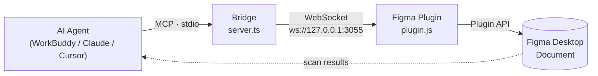

# Figma Page Auto-Translation — multilingual, layout-preserving

> Machine-translate every text node on a Figma page and write it back **in place**, preserving font family / weight / size, alignment (including RTL `LEFT↔RIGHT` flip), color, position and auto-resize. A built-in re-scan asserts **0 residual source-language characters**.

[中文 README](./README.md) · [Illustrated setup guide (Word)](./docs/figma-translate-guide.docx)

---

## Why this exists

The Figma **REST API is read-only**. To change text on the canvas you must go through the **Figma Plugin API** (a plugin running inside Figma Desktop). So the hard part of "let AI translate my page" isn't translation — it's **writing back**.



---

## Real-world result

French → Arabic (RTL), one production page:

| Metric | Result |
| --- | --- |
| Text nodes on page | 798 |
| Translated | 719 (incl. 4 stray Russian company-info nodes) |
| Kept as-is | 79 (model numbers / email / URLs / phone / numbers / units) |
| **Residual source text** | **0** (French, Russian and Chinese all cleared) |
| Fonts | 719 translated → `Noto Sans Arabic`; 79 kept → original `MiSans VF` |
| Alignment | RIGHT 342 / CENTER 401 / LEFT 55 |
| Tofu (missing glyphs) | 0 |

---

## Repo layout

```
figma-page-translate/
├── SKILL.md                  # the skill itself (read by the AI agent)
├── README.md / README_EN.md
├── LICENSE                   # MIT
├── docs/                     # illustrated Word guide (Chinese)
└── assets/bridge/            # runnable write-bridge source
    ├── server.ts             # MCP stdio server (scan / write / verify / list_fonts)
    ├── package.json / tsconfig.json / .vscode/mcp.json
    ├── plugin/               # manifest.json, plugin.js, ui.html
    └── script/build_batch.mjs# generic build template — edit CONFIG and reuse
```

---

## Quick start

Clone the repo (you only need `SKILL.md` for the agent and `assets/bridge/` for the bridge):

```bash
git clone https://github.com/SeeseaQ/figma-page-translate.git
```

```bash
cp -r assets/bridge ~/.workbuddy/figma-bridge
cd ~/.workbuddy/figma-bridge && npm install
```

Register it as an MCP server (`~/.workbuddy/mcp.json`):

```json
{
  "mcpServers": {
    "figma-write": {
      "type": "stdio",
      "command": "npx",
      "args": ["tsx", "C:/your/path/figma-bridge/server.ts"]
    }
  }
}
```

Then: **Plugins → Development → Import plugin from manifest** → pick `assets/bridge/plugin/manifest.json`, and run **MCP Figma Write Bridge** once per session.

Install `SKILL.md` into your agent's skills folder, open the page in Figma, and say:

> "Translate this page into Arabic — mind the text direction and text-box position."

---

## Bridge tools

| Tool | Purpose |
| --- | --- |
| `get_all_text` | Scan every text node (page / nodeId / text / font / size / alignment / color) |
| `set_text` | Single-node write, **synchronously** returns `fontApplied` (use to probe fonts) |
| `set_text_batch_file` | Bulk write from a JSON file; queued + drained serially to avoid timeouts |
| `list_fonts` | List fonts available in Figma — **always run this before picking a target font** |
| `verify_page` | Re-scan a page: residual counts, font histogram, alignment histogram → JSON |

---

## Language support

Any source → target pair.

| Target | Direction | Alignment |
| --- | --- | --- |
| Arabic / Hebrew / Persian | RTL | flip `LEFT ↔ RIGHT`, keep `CENTER` / `JUSTIFIED` |
| French / Spanish / Turkish / Russian | LTR | unchanged |
| Chinese / Japanese | LTR | unchanged |

---

## Gotchas (learned the hard way)

| Pitfall | Consequence | Fix |
| --- | --- | --- |
| Hand-retyping a dictionary key instead of copying the node text | Node **silently** left untranslated | Key by the exact node `characters`; diff codepoints on mismatch |
| Invisible chars `U+2028/2029/200B-200D/FEFF` | `===` never matches | Normalize first; build regexes with `String.fromCodePoint()` |
| Font family/style name not exactly matching Figma | Font load fails → falls back → **tofu** | Read the real name from `list_fonts`; probe with `set_text`, require `fontApplied: true` |
| Installing a font inside a sandbox/container | Desktop Figma **can't see it** | Prefer a font already in Figma (e.g. `Noto Sans Arabic`) |
| `require` in `.mjs`, or Git-Bash `/c/...` paths on Windows | Node throws | Use ESM `import`; pass `C:/...` paths |

---

## Limits & disclaimer

- Only text content, font and alignment change. Text boxes are never moved, added or deleted.
- Final **RTL visual quality** (line breaks, punctuation placement, cramped boxes) deserves a human pass — the machine doesn't sign off on "done".
- Snapshot a Figma version before a bulk write so you can roll back.

## License

[MIT](./LICENSE)
